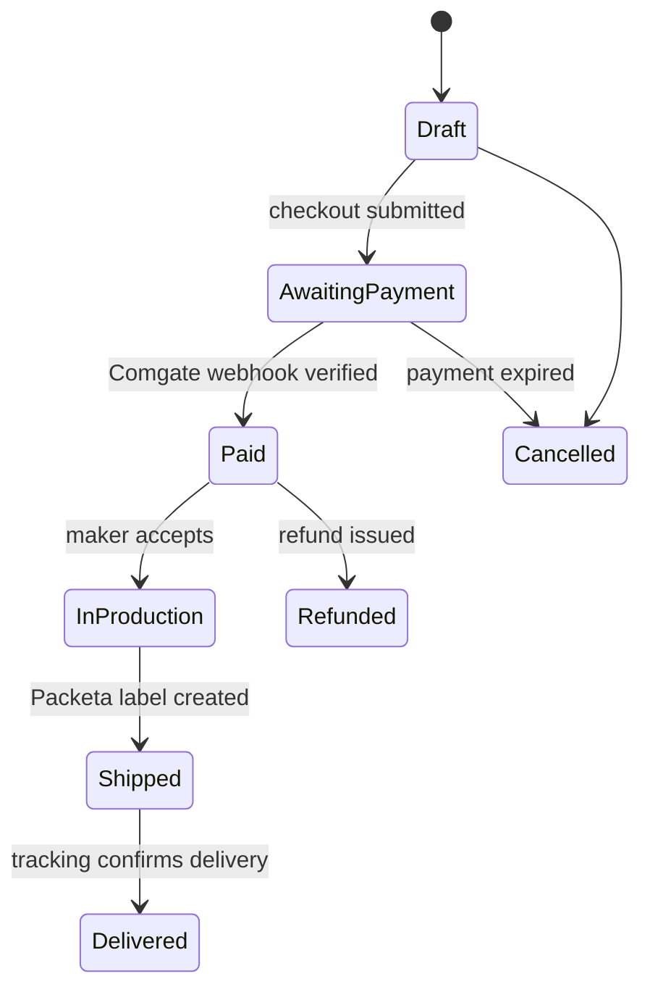

# Documentation — Role-Owned, Living, In-Parallel

Every role keeps its own living documentation, updated **in parallel with the work** by the role that
owns it. A finalized story/decision/ticket with stale docs is **not finalized**. This is how the team
keeps track of business logic, decisions, and implementation as the platform changes — instead of
docs rotting into fiction.

## Who owns what

| Role | Owns | Location | Contains |
|---|---|---|---|
| **ba** | the **business-logic** view | `agents/ba/<subsystem>.md` | the subsystem's business rules in prose **+ Mermaid diagrams** (flows, state machines, decision trees), the living **story map** (which stories cover which capability), open questions |
| **architect** | the **decision** view | `docs/architecture/roles/<responsibility>.md` (responsibility-driven design) + `agents/architect/<topic>.md` (evolving trade-off notes) | living design notes, the trade-off space, current shape, links to the immutable ADRs. (The **ADRs** themselves stay in [`docs/adr/`](../../docs/adr/) — immutable once accepted; these decision docs are the *evolving* companion that explains the current state.) |
| **dotnet-backend / dotnet-db / frontend / l10n** | the **implementation** view | `docs/architecture/*` (canonical, published) + short impl notes in the ticket | how it's actually built; kept in sync by the author of the change when behavior ships (Gate 7) |
| **writer of the change** | the **published** view | `docs/**` + status log | the polished, dev-facing output synced from the above; there is no separate docs agent — whoever ships the behavior owns the published page ([quality-gates.md](../../docs/process/quality-gates.md) Gate 7) |

> Internal deliberation/working docs live under `agents/` (not the published tree). The published
> `docs/` stays the clean output. The three internal views (ba/architect/dev) are separate trees
> so each role's living doc is theirs to maintain, but they **cross-link**: a ba business-logic
> doc links the architect decision docs and the dev docs for the same subsystem, and vice versa.

## Subsystems (the unit of documentation)

Use the same subsystem grouping as the audit ([docs/audits/INDEX.md](../../docs/audits/INDEX.md)), so docs
map to how we think about the system and to the per-audience hosts:

| Subsystem | Covers | Primary hosts |
|---|---|---|
| **identity** | users, makers, sessions, passwords, magic links, email confirmation, OAuth, JWT, refresh tokens, RBAC | Web.Customer (5001), Web.Maker (5002), Web.Admin (5003) |
| **catalog** | products, variants, media, search, browse, taxonomy, maker storefronts | Web.Customer (5001), Web.Maker (5002), Web.Public (5104) |
| **orders** | cart, checkout, payments, shipping, order lifecycle, webhooks, invoices, payouts, refunds | Web.Customer (5001), Web.Maker (5002), Azure Functions |
| **platform** | cross-cutting: outbox, audit log, i18n, observability, deployment, `CountryConfiguration`, NSwag contract, shared infra | all hosts |

One `agents/ba/<subsystem>.md` and the relevant `docs/architecture/roles/<responsibility>.md` +
`agents/architect/<topic>.md` per area. Finer-grained responsibilities (e.g. `order-pricing`,
`invoice-numbering`, `payment-provider`) already have their own responsibility docs under
[docs/architecture/roles/](../../docs/architecture/roles/) — link them from the subsystem doc rather than
duplicating.

## Mermaid diagram conventions (ba)

Diagrams are **diagrams-as-code** (Mermaid in fenced ```mermaid blocks) so they live in Git, diff
cleanly, and render on the published docs. Per subsystem, maintain at least:

- a **flow** for each primary capability (e.g. "place an order", "confirm payment", "run a payout batch"),
- a **state machine** for each lifecycle (order status, invoice, dispute, payout batch),
- a **decision tree** where business rules branch (fiscal mode by `CountryConfiguration`, cancellation-fee
  rate, pricing override precedence).



(The example above is the order lifecycle — every subsystem's lifecycles get one like it, kept current.
Money moves in `long` minor units + `string Currency`; state transitions are the backend's job, never
the frontend's.)

## The update rule (when, by whom)

- A **story** is finalized (survives the Defense loop — [deliberation.md](../../docs/process/deliberation.md))
  → the **author ba** updates `agents/ba/<subsystem>.md`: add/adjust the business rule, update the diagram,
  add the story to the map — **in the same step**. The PM won't mark the story ready if the doc wasn't
  updated.
- A **decision/ADR** is accepted → the **author architect** updates the relevant
  `docs/architecture/roles/<responsibility>.md` + `agents/architect/<topic>.md` and writes the immutable ADR
  in [docs/adr/](../../docs/adr/) (with `## Alternatives considered`, and `## Defense` if it was challenged).
- A **ticket** ships behavior → the **author of the change** (dotnet-backend, dotnet-db, frontend, or l10n)
  updates the implementation note in the ticket and syncs `docs/**` per [quality-gates.md](../../docs/process/quality-gates.md)
  Gate 7. l10n additionally keeps the `cs-CZ` catalog in parity with every new `BusinessErrorMessage` code.

## Keeping it honest

- Docs describe what's **decided/built now**, not aspirations (aspirations are stories/tickets).
- A diagram that contradicts the code is a defect — the reviewer flags it like any other Gate-1 miss.
- Cross-links must resolve; a dangling link is a doc bug.
- The **writer of each change** reconciles the published `docs/` against the internal ba/architect docs
  and the code at ship time; `/audit` runs (see [docs/audits/INDEX.md](../../docs/audits/INDEX.md)) raise
  accumulated drift as findings under the owning dimension.

## Related

- [docs/process/deliberation.md](../../docs/process/deliberation.md) — the Defense loop and user-as-challenger protocol
- [docs/process/ticket-lifecycle.md](../../docs/process/ticket-lifecycle.md) — where the doc-update rule fits the ticket states
- [docs/process/quality-gates.md](../../docs/process/quality-gates.md) — Gate 7 (Docs) enforcement
- [docs/audits/INDEX.md](../../docs/audits/INDEX.md) — the subsystem × dimension grouping this doc reuses
- [docs/architecture/patterns.md](../../docs/architecture/patterns.md) — the canonical pattern catalog
- [docs/architecture/roles/](../../docs/architecture/roles/) — responsibility-driven design docs (architect view)
- [docs/adr/](../../docs/adr/) — the immutable decision record
